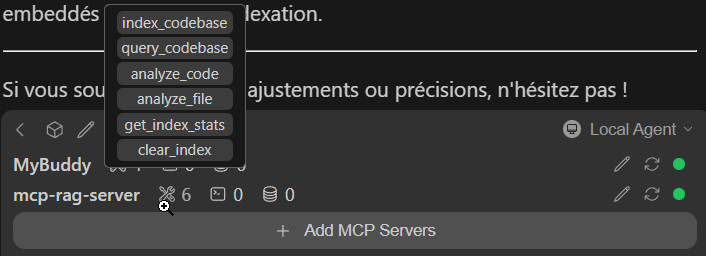
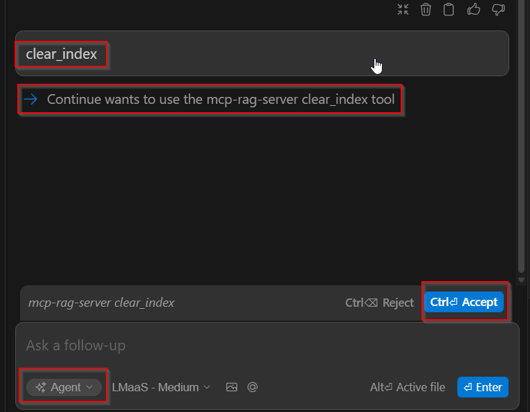
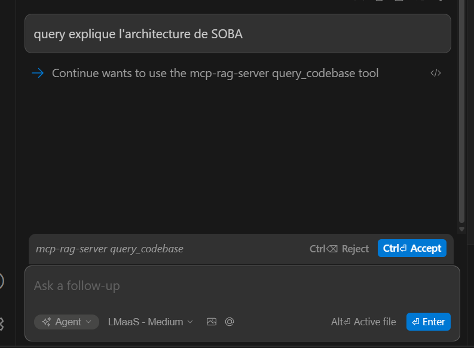
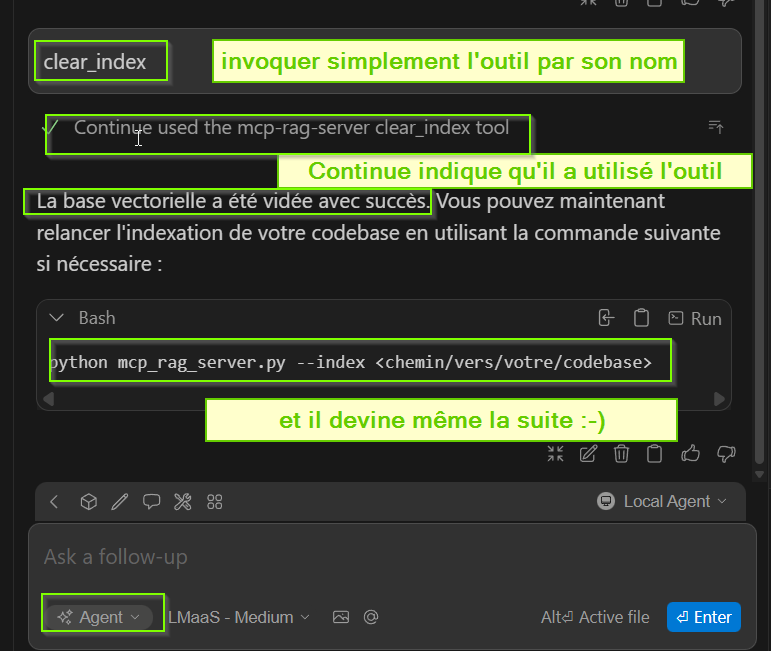

# Installation - Mistral

## Prérequis

- Python 3.13+
- Un repo avec ces commandes pour rendre anonyme github:
```cmd
git config --global user.email "<23147820+frsauvage@users.noreply.github.com>"
git config --global user.name "Francine Sauvage"
```
## Installation des prérequis
### Python 3.13+
Pour installer Python, désarchiver juste un fichier zippé de la version de python désirée dans un  répertoire quelconque.   
**Important** : ne PAS changer le _PYTHON_HOME_

### uv (optionnel)
```cmd
# 1. Créer et configurer le fichier **%APPDATA%/uv/.env**
ARTIFACT_USER=<TGI>
ARTIFACT_PASSWORD=<your artifactory pwd>
ARTIFACT_URL=<miroir github>
UV_INSTALL_DIR=/d/uv
UV_PYTHON=</path/to>/Py64/python
UV_INDEX_USERNAME=<TGI>
UV_INDEX_PASSWORD=<your artifactory pwd>
```

```yaml
# 2. Créer et configurer le fichier **%APPDATA%/uv/uv.toml**
system-certs = true
cache-dir = "</path/to/your/tgi>\\MyApp\\.uv\\cache"
python-install-mirror = "https://<TGI>:<artifactory_password>:@<ARTIFACTORY_URL>/astral-sh/python-build-standalone/releases/download"

[[index]]
url = "https://<TGI>:<artifactory_password>@<ARTIFACTORY_URL>api/pypi/.../simple"
default = true

```

```bash
# 3. Lancer
uv-installer.sh
```

## Installation
### Etapes

```bash
# 1. Copier le projet
cd mcp_rag_server
```

#### Créer un environnement virtuel

```bash
# 2. Créer un environnement virtuel !! à partir d'un terminal
python -m venv venv
venv\Scripts\activate
```
ou
```bash
# 2. Créer un environnement virtuel !! à partir d'un git bash
$ uv venv
Using CPython 3.13.11 interpreter at: xxxxx\python\python.exe
Creating virtual environment at: .venv
Activate with: .venv\Scripts\activate
```

#### Activer un environnement virtuel
Ouvrir un terminal et activer l'environnement virtuel:
```bash
cd D:\IA\mcp_rag_server
.venv\Scripts\activate
```

#### 3. Installer les dépendances
```bash
uv sync -v
```

### 4. Configuration Continue / MCP

Éditez votre fichier `config.yaml` de Continue (`.continue/config.yaml`):

```yaml
mcpServers:
  ...
  - name: mcp-rag-server
    command: ${{ secrets.MCP_RAG_PROJECT_ROOT }}\.venv\Scripts\python.exe
    args: 
      - ${{ secrets.MCP_RAG_PROJECT_ROOT }}\mcp_rag_server.py
    env:    
      API_KEY: ${{ secrets.MISTRAL_API_KEY }}
      MCP_RAG_PROJECT_ROOT: ${{ MCP_RAG_PROJECT_ROOT }}
```

**Important**: Adaptez les chemins selon votre installation.

#### Utiliser les tools MCP

- **Tools disponibles** :
  

- **Flux de nettoyage** :
  

- **Flux d'indexation** :
  

- **Flux de requête** :
  

#### Examples
  


## Ollama
### Ajout du modèle local (si ollama)

```batch
ollama pull nomic-embed-text
ollama pull mistral
ollama pull gpt-oss
```
## Exploitation

### Mise à jour des modèles locaux (si ollama)

```batch
for /f "tokens=1" %i in ('ollama list') do ollama pull %i
```

## Dépannage

- Vérifiez que le venv est activé
- Vérifiez que la clé API est correcte
- Vérifiez que les dépendances sont installées: `pip list`
